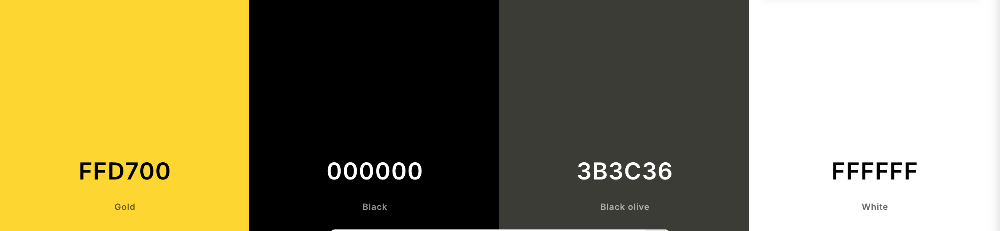
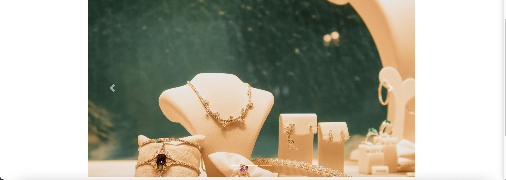

# Jewelry Palace 

## Introduction

Jewelry Palace is a fictional e-commerce jewellery retailer based in England. Founded in November 2024, Jewelry Palace specialises in selling jewellery, bought from a manufacturers clearance stock and then sold at a discounted price online

## Purpose & objective

* Enhanced User Experience:
    * Design a user-friendly website that is visually appealing, intuitive and easy enough to navigate
    * Ensuring that that the app/website is accessible and fully responsive across all devices including, mobiles, tabelts and desktop/laptops

* Security & Reliability:
    * The Implementation of strong authentication and authorization process to protect user data
    * Conducting code validation and security testing in order to maintain a stable, secure application.

* Smooth Payment Process and checkout:
    * Develop a smooth and secure payment process in order to enhance the checkout experience.

* Support Continuous Improvement:
    * With the help of Agile methodologies to help deliver quality features and enhancement

* Performance and accessibility: 
    * Ensuring fine-tuning the website for faster loading times and fast responses to user actions
    * Making sure accessibility standards are met for an inclusive user experience.

* Admin/ Site owner to user/customer Engagment:
    * Create avenues for users to provide feedback, report issues and possible enhancement suggestion
    * Responding to user feedback as the site owner and work on intergrating improvements where appropriate.

## Target Audience

* Casual Shoppers
* Jewellery enthusiast
* Gift givers

The purpose of Jewelry Palace is to cater to jewellery enthusiast who value unique, small-boutique still products and a premium shopping experience. This platform is designed for:

  - Customers seeking high quality, jewellery at a discounted price
  - Users who require intuitive and efficient shopping experience, including mobile-friendly navigation  and streamlined checkouts
  - Returning shoppers who appreciate order history tracking and secure account features

By addressing these needs, Jewelry Palace aims to bridge the gap between boutiquq jewelry brands and their online customers

## Table of Contents 

1. [Introduction](#introduction)
2. [Project Planning](#project-planning)
3. [UX](#ux-user-experience)
4. [Database Structure](#database-structure)
5. [Design](#design)
6. [Features](#features)
7. [Web Marketing](#web-marketing)
8. [Social Media](#social-media)
9. [Technologies Used](#technologies-used)
10. [Testing](#testing)
11. [Deployment](#deployment)
12. [Credits](#credits)

[Back to Top ⇧](#jewelry-palace)

# UX User Experience

User stories are usually short, simple descritpions of a feature or functionally told from the perspective of the user. The user help ensures the development process remains user-focused. Below are the user stories created for this project:

## User stories

* As a user, I can browse the product categories in order to find what I am looking for [#1](https://github.com/KyrianU/Jewelry_palace/issues/1)
* As a user, I want to be able to search for a product by name in order to locate specific items with ease [#3](https://github.com/KyrianU/Jewelry_palace/issues/3)
* As a user, I can see a detailed breakdown of my order total, which information such as discounts cost, shipping costs in order to gain a full understanding of the full price I am paying. [#10](https://github.com/KyrianU/Jewelry_palace/issues/10)
* As a user, I'm able to receive an email confirmation once I've completed my order - which confirms my order has been successfull. [#11](https://github.com/KyrianU/Jewelry_palace/issues/11)
* As a user, I want to be able to see some details regarding the product information in order to make an informed purchase [#5](https://github.com/KyrianU/Jewelry_palace/issues/5)
* As a user, I want to be able to login and register in order to save my details and view my order history [#6](https://github.com/KyrianU/Jewelry_palace/issues/6)
* As a user, I want to be able to freely shop on the website, wishing for my data to be protected [#7](https://github.com/KyrianU/Jewelry_palace/issues/7)
* As a user, I want to a receive a confirmation message for when my order has been successful [#9](https://github.com/KyrianU/Jewelry_palace/issues/9)
* As a user, I can securely save my payment details so that futures purchases are made quicker and easier (if logged in) [#16](https://github.com/KyrianU/Jewelry_palace/issues/16)
* As a user, I can sign up for a newsletter so I can receive regular updates and promotions [#17](https://github.com/KyrianU/Jewelry_palace/issues/17)
* As a user, I can leave reviews for products so that I can share feedback with other customers [#18](https://github.com/KyrianU/Jewelry_palace/issues/18)

### Admin User stories

* As an Admin, I can add new products to the collection so that users can see and purchase the latest item available on the site. [#12](https://github.com/KyrianU/Jewelry_palace/issues/12)
* As an admin, I can edit existing product detail such as name, price, and description in order for the collection to be up to date as always [#13](https://github.com/KyrianU/Jewelry_palace/issues/13)
* As admin, I have the functionality to delete products from the site if I wanted to discontinue a certain product or refresh the site. [#14](https://github.com/KyrianU/Jewelry_palace/issues/14)
* As an admin, I am able to assign products to specific categories so that users can have an easier time finding their chosen item while browsing [#15](https://github.com/KyrianU/Jewelry_palace/issues/15)

* As a user, I can access to website on my mobile device so that I can browse and shop like I would on PC.
* As a user, I can see a summary of the product in my cart so that I can confirm my order is correct before checking out.
* as a User, I can access a clear navitgation menu in order to find information or products I need.
* As a user, I am able to access a secure checkout process.

## Returning User

* As a returning user, I want to be able to see my previous orders and choose to order if I see fit to
* as a returning user, I want to be able to leave reviews for product that I have previously purchased
* As a returning user, I want to save my payment details so that future purchases are made faster
* As a returning user, I can securely leave my shipping details so that any future purchases can be made faster.

# Planing

## Agile Methodology

### Overview

Agile methodology is a project management approach that focuses on teamwork, flexibility, making steady progress towards a clear objective. Agile methodology strive to deliver small, incremental product updates which enhance the quality and also allows for quick adaptation to changing needs.

### MoSCow Prioritization

The MoSCow prioritization technique is a framework for assessing the importance of different features and task within a project. It ranks items into four categories: Must Have, Should Have, Could Have and Won't have. This approach helps with time management by making sure that the most important features are priortised and completed first.

### GitHub Projects

Github projects provides a way to to manage tasks and monitor ongoing progress using project boards. Each colums tracks the status of tasks, ranging from 'To Do', 'In Progress' and 'Done. This approach helps with time management by ensuring that the most important tasks are prioritised and completed first

  
GitHub Project

  

  

## Testing

### Manual testing 

### Manual testing scenarios and results

| Feature | Test  | Expected Results  | Actual Result |
|---------|------|------------------| :----:|
| Jewelry Palace logo | Selecting Jewelery Palace on homepage | direct user to homepage | Pass  |
| Navigation Links | Selecting navigation links  | directs users to relevant categories | Pass  |
| All categories  | Selecting all for each category  | directs users to show all relevant categories on the same page |  Pass  |
| Sort by  | Selecting the filter sort by for each category | Successfully alters by price, rating, category and name | Pass |
| About us | Selecting About us | directs users to the about us Page | Pass  |
| Privacy Policy  | Selecting Privacy Policy | directs users to the about page | Pass |
| Terms % conditions | Selecting Terms and condition | directs users to the terms and condition page | pass  |
| Register  | Register for an account  | selecting Register in my account directs users to accounts/login/ signup page  | Pass |
| Login  | Login to account | Selecting login in my account directs user to accounts/login page | Pass
| Back to top  | Back to top box  | Selecting the back to top on the products pages brings the user back to the top of the page | Pass
| New User  |  Registering as a new user | Registering as a new user via form validation | Pass
| Admin  | Loggin in as admin/superuser  | Logging in as superuser/ admin directs the the user to the admin page, where the admin has access to product management page  | Pass
| login successfull message | login success | successfully signed in as {user.name} | Pass  |
| Add product  | adding a new product  |  Adding a new product on the product managemment page successfully  |  Pass  |
| Edit product | Editing a product | Editing a product on the product management page sucessfully |Pass |
| Delete Product| Deleting a product|Deleting a product on the product management page sucessfully| Pass |
|Logout | logging out and redirect  | logging out as a user / admin directs user to homepage | Pass |
|Logout message | logout message shown | You have succesfully signed out message shown to the user once successfully signed out | Pass  |
Footer | Social media links | clicking on social media icons in the footer open the link in a new tab | Pass |
Footer | Contact info | footer display clear contact info as to how to get in touch | Pass |

# Database Structure 

## Entity Relationship Diagram

The Database scheme for Jewelry Palace is designed to efficiently all of the core functionality while maintaining data integrity and adequate performance. Below is the diagram show how the various models are connected to each other:

  
Database Scheme

  

  

7 Tables was created for the Wesbite. Order, OrderLineItem, Review, Contact, Product, Category and UserProfile

The Contact table is used by users to submit queries that they may have, ranging from general inquiries, Returns, Order, Feedback, Availability and any oher adhoc queries. It has the following fields of Primary Key ID, name, email, subject and body.

The Product model contains information regarding all the products listed on the website. It has the following field as Primary Key of ID, name, sku, descriptions, price, has_sizes, rating, image and catergory_id

The UserProfile table contains information in relation to the user's profile. It has the following fields of Primary Key ID, user_id, default_phone_number, default_country, default_county, default_postcode, default_town_or_city, default_street_address1, default_street_address2

The Review table is used by users to submit a review on a product they've already purchased. It has the following fields of Primay Key ID, product_id, name, email, comment, created_on and approved_on

The Category table is highlights what category the products listed on the website falls into. It has a primary key ID, name and friendly_name

The Order model contains information in relation to a customer's final order. It has the following field Primary Key Id, order_number, user_profile, full_name, email, phone_number, country, postcode, county, town_or_city, street_address1, street_address2, date, grand_total, order_total, delivery_cost, original_bag, stripe_pid and user_profile_id.

The OrderlineItem table contains information in regards to an order. It has the following fields Primary Key Id, product_size, quantity, lineitem_total, order_id and product_id.

# Design

## Wireframes

The wireframes for the website provides a visual representation of the layout and structure of the website.
They outline the placements of where the key elements will go (i.e navigation menus, user profiles, main content area and any interactive features). Although the wireframes ensures a cohesive and intuitive user interface, the final live version deviates contains some slight deviation to what is on the wireframes

  
Wireframes

  
  
  
  
  
  
  
  
  
  

  

## Typography

Roboto Condensed is the primary font taken from Google Fonts. The primary reason for this fonts was for its geometric font which features friendly and open curves. Fall back fonts are Lato and sans-serif.

## Color Palette 

I chose the color combination below for the app as I believe it was the best set of colors to represent a jewellery website.

  
Color Palette

  

  

The main colors used in the project are:

  - FFD700 (Gold): Used for the heading and product outline. The gold color evokes elegance and wealth. I felt that the color aligned itself perfectly with what a jewellery website and instantly signals premium quality.

  - 000000 (Black): Used for the Naviation bars, the footer, some buttons. The black went well with the gold and white as it provided a good contrast as well as helping the gold and white pop out without overpowering them. 

  - FFFFFF (White): The white keeps the design of the site clean and very easy to navigate. It also provides breathing spaces and enhances redability.

# Features

## Header 

The navigation bar is the same across all the pages, this was designed for the purpose of providing the users with a familiar layout, which allows them to focus on the content of each page. The logo is situated at the top left hand side of the, it is also acting as a home page link. The navigation bar includes a collapsable profile menu with changing options depending on whether the user is logged in not logged in, or whether the user is a site admin. The navigation bar includes a search field for product searches.
The header includes the main background image, which also features a welcome message across the home page.

  
Navigation Bar

  

  

  
Hero Image & Links

  

  

  
Profile navigation

  

  

## Footer

The footer is the same across all the pages, this was designed for the purpose of providing the users with a familiar layout, which allows them to focus on the content on each page. It follows the same color scheme as the navigation bars to provide the bottom frame of the content. The footer contains social media links (Facebook, Twitter and Instagram). The footer also contains business contact information. Finally, the footer also contains a simple newsletter signup field, which allows users to suscribe by entering their email address.

  
Footer

  

  

### Home 

The Homepage features a carousel just underneath the hero image. The carousel consists of 3 images. 

  
Carousel 1

  

  

  
Carousel 2

  

  

  
Carousel 3

  

  

### Product Page

Each product is presented on a card. These cards have a hover effect (gold), this is to provide visual feedback to the user. When the product card, the user is then redirected to the product detail page. Products can be added to the basket from the product page. On the products page, items can be sorted according to price, rating, name and category.

  
Product List

  

  

### Product detail 

The product detail page is where the user will find all relevant information about a product. Clicking the image in the product page will redirect the user to the product detail page. Products can then be added to the bag up until the maximum quantity available. Logged in users have the option to view and leave product review whereas guest users can only view existing reviews.

  
Product Detail

  

  

  