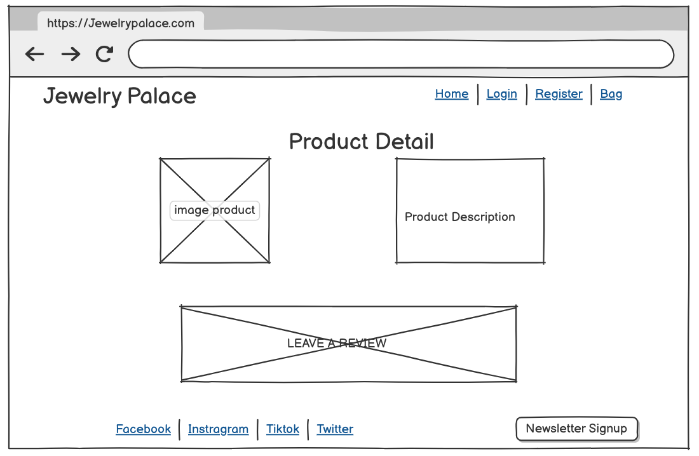
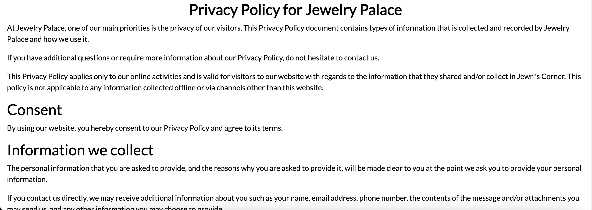

# Jewelry Palace 

## Introduction

Jewelry Palace is a fictional e-commerce jewellery retailer based in England. Founded in November 2024, Jewelry Palace specialises in selling jewellery, bought from a manufacturers clearance stock and then sold at a discounted price online

## Purpose & objective

* Enhanced User Experience:
    * Design a user-friendly website that is visually appealing, intuitive and easy enough to navigate
    * Ensuring that that the app/website is accessible and fully responsive across all devices including, mobiles, tabelts and desktop/laptops

* Security & Reliability:
    * The Implementation of strong authentication and authorization process to protect user data
    * Conducting code validation and security testing in order to maintain a stable, secure application.

* Smooth Payment Process and checkout:
    * Develop a smooth and secure payment process in order to enhance the checkout experience.

* Support Continuous Improvement:
    * With the help of Agile methodologies to help deliver quality features and enhancement

* Performance and accessibility: 
    * Ensuring fine-tuning the website for faster loading times and fast responses to user actions
    * Making sure accessibility standards are met for an inclusive user experience.

* Admin/ Site owner to user/customer Engagment:
    * Create avenues for users to provide feedback, report issues and possible enhancement suggestion
    * Responding to user feedback as the site owner and work on intergrating improvements where appropriate.

## Target Audience

* Casual Shoppers
* Jewellery enthusiast
* Gift givers

The purpose of Jewelry Palace is to cater to jewellery enthusiast who value unique, small-boutique still products and a premium shopping experience. This platform is designed for:

  - Customers seeking high quality, jewellery at a discounted price
  - Users who require intuitive and efficient shopping experience, including mobile-friendly navigation  and streamlined checkouts
  - Returning shoppers who appreciate order history tracking and secure account features

By addressing these needs, Jewelry Palace aims to bridge the gap between boutiquq jewelry brands and their online customers

## Table of Contents 

1. [Introduction](#introduction)
2. [Project Planning](#project-planning)
3. [UX](#ux-user-experience)
4. [Database Structure](#database-structure)
5. [Design](#design)
6. [Features](#features)
7. [Web Marketing](#web-marketing)
8. [Social Media](#social-media)
9. [Technologies Used](#technologies-used)
10. [Testing](#testing)
11. [Deployment](#deployment)
12. [Credits](#credits)

[Back to Top ⇧](#jewelry-palace)

# UX User Experience

User stories are usually short, simple descritpions of a feature or functionally told from the perspective of the user. The user help ensures the development process remains user-focused. Below are the user stories created for this project:

## User stories

* As a user, I can browse the product categories in order to find what I am looking for [#1](https://github.com/KyrianU/Jewelry_palace/issues/1)
* As a user, I want to be able to search for a product by name in order to locate specific items with ease [#3](https://github.com/KyrianU/Jewelry_palace/issues/3)
* As a user, I can see a detailed breakdown of my order total, which information such as discounts cost, shipping costs in order to gain a full understanding of the full price I am paying. [#10](https://github.com/KyrianU/Jewelry_palace/issues/10)
* As a user, I'm able to receive an email confirmation once I've completed my order - which confirms my order has been successfull. [#11](https://github.com/KyrianU/Jewelry_palace/issues/11)
* As a user, I want to be able to see some details regarding the product information in order to make an informed purchase [#5](https://github.com/KyrianU/Jewelry_palace/issues/5)
* As a user, I want to be able to login and register in order to save my details and view my order history [#6](https://github.com/KyrianU/Jewelry_palace/issues/6)
* As a user, I want to be able to freely shop on the website, wishing for my data to be protected [#7](https://github.com/KyrianU/Jewelry_palace/issues/7)
* As a user, I want to a receive a confirmation message for when my order has been successful [#9](https://github.com/KyrianU/Jewelry_palace/issues/9)
* As a user, I can securely save my payment details so that futures purchases are made quicker and easier (if logged in) [#16](https://github.com/KyrianU/Jewelry_palace/issues/16)
* As a user, I can sign up for a newsletter so I can receive regular updates and promotions [#17](https://github.com/KyrianU/Jewelry_palace/issues/17)
* As a user, I can leave reviews for products so that I can share feedback with other customers [#18](https://github.com/KyrianU/Jewelry_palace/issues/18)

### Admin User stories

* As an Admin, I can add new products to the collection so that users can see and purchase the latest item available on the site. [#12](https://github.com/KyrianU/Jewelry_palace/issues/12)
* As an admin, I can edit existing product detail such as name, price, and description in order for the collection to be up to date as always [#13](https://github.com/KyrianU/Jewelry_palace/issues/13)
* As admin, I have the functionality to delete products from the site if I wanted to discontinue a certain product or refresh the site. [#14](https://github.com/KyrianU/Jewelry_palace/issues/14)
* As an admin, I am able to assign products to specific categories so that users can have an easier time finding their chosen item while browsing [#15](https://github.com/KyrianU/Jewelry_palace/issues/15)

* As a user, I can access to website on my mobile device so that I can browse and shop like I would on PC.
* As a user, I can see a summary of the product in my cart so that I can confirm my order is correct before checking out.
* as a User, I can access a clear navitgation menu in order to find information or products I need.
* As a user, I am able to access a secure checkout process.

## Returning User

* As a returning user, I want to be able to see my previous orders and choose to order if I see fit to
* as a returning user, I want to be able to leave reviews for product that I have previously purchased
* As a returning user, I want to save my payment details so that future purchases are made faster
* As a returning user, I can securely leave my shipping details so that any future purchases can be made faster.


[Back to Top ⇧](#jewelry-palace)


# Planing

## Agile Methodology

### Overview

Agile methodology is a project management approach that focuses on teamwork, flexibility, making steady progress towards a clear objective. Agile methodology strive to deliver small, incremental product updates which enhance the quality and also allows for quick adaptation to changing needs.

### MoSCow Prioritization

The MoSCow prioritization technique is a framework for assessing the importance of different features and task within a project. It ranks items into four categories: Must Have, Should Have, Could Have and Won't have. This approach helps with time management by making sure that the most important features are priortised and completed first.

### GitHub Projects

Github projects provides a way to to manage tasks and monitor ongoing progress using project boards. Each colums tracks the status of tasks, ranging from 'To Do', 'In Progress' and 'Done. This approach helps with time management by ensuring that the most important tasks are prioritised and completed first

<details>
  <summary>GitHub Project</summary>

  

  </details>

## Testing

### Manual testing 


Comprehensive testing has been done across all aspects of the application. For more detailed testing analysis and documentation, including manual testing procdures, code testing analysis, accessibility testing cross-browser and device tesing procedures, please refer to:

[TESTING.md](TESTING.md)


[Back to Top ⇧](#jewelry-palace)


# Database Structure 

## Entity Relationship Diagram

The Database scheme for Jewelry Palace is designed to efficiently all of the core functionality while maintaining data integrity and adequate performance. Below is the diagram show how the various models are connected to each other:

<details>
  <summary>Database Scheme</summary>

  

  </details>


7 Tables was created for the Wesbite. Order, OrderLineItem, Review, Contact, Product, Category and UserProfile

The Contact table is used by users to submit queries that they may have, ranging from general inquiries, Returns, Order, Feedback, Availability and any oher adhoc queries. It has the following fields of Primary Key ID, name, email, subject and body.

The Product model contains information regarding all the products listed on the website. It has the following field as Primary Key of ID, name, sku, descriptions, price, has_sizes, rating, image and catergory_id

The UserProfile table contains information in relation to the user's profile. It has the following fields of Primary Key ID, user_id, default_phone_number, default_country, default_county, default_postcode, default_town_or_city, default_street_address1, default_street_address2

The Review table is used by users to submit a review on a product they've already purchased. It has the following fields of Primay Key ID, product_id, name, email, comment, created_on and approved_on

The Category table is highlights what category the products listed on the website falls into. It has a primary key ID, name and friendly_name

The Order model contains information in relation to a customer's final order. It has the following field Primary Key Id, order_number, user_profile, full_name, email, phone_number, country, postcode, county, town_or_city, street_address1, street_address2, date, grand_total, order_total, delivery_cost, original_bag, stripe_pid and user_profile_id.

The OrderlineItem table contains information in regards to an order. It has the following fields Primary Key Id, product_size, quantity, lineitem_total, order_id and product_id.


[Back to Top ⇧](#jewelry-palace)


# E-Commerce Business Model

Jewelry Palace is an online jewellery store that uses an e-commerce model to sell jewellery directly to customers via its website. The model is designed to provide a fluid and personalised shopping experience while accomodating to a diverse audience of jewellery lovers:

Essentials components of the Jewelry Palace model include:

  1. *Direct Business to Consumer Sales*: Jewelry Palace offers a variety of jewelleries direclty to the consumer (Avoiding wholesalers or retailers). This method allows for a more customsised shopping experience for the consumer and a higher profit margin.

  2. *Diverse Product Range*: The wesbite has a variety of stocked jewellery, including rings, ring set, necklaces and bracelets. 

  3. *Digital Marketing and SEO*: Jewelry Palace uses various digital marketing strategies which includes search engine optimization(SEO), social media engagment, newsletter campaign and content marketing. This is use to attract and retain customers.

  4. *Target Audience*: 

    - Primary: Jewellery enthusiast
    - Secondary: Casual shoppers
    - Geographic: Initially UK with the plan to expand Worldwide 

# Design

## Wireframes

The wireframes for the website provides a visual representation of the layout and structure of the website.
They outline the placements of where the key elements will go (i.e navigation menus, user profiles, main content area and any interactive features). Although the wireframes ensures a cohesive and intuitive user interface, the final live version deviates contains some slight deviation to what is on the wireframes

<details>
  <summary>Wireframes</summary>

  
  
  
  
  
  
  
  
  
  

  </details>


## Typography

Roboto Condensed is the primary font taken from Google Fonts. The primary reason for this fonts was for its geometric font which features friendly and open curves. Fall back fonts are Lato and sans-serif.

## Color Palette 

I chose the color combination below for the app as I believe it was the best set of colors to represent a jewellery website.

<details>
  <summary>Color Palette</summary>

  

  </details>

The main colors used in the project are:

  - FFD700 (Gold): Used for the heading and product outline. The gold color evokes elegance and wealth. I felt that the color aligned itself perfectly with what a jewellery website and instantly signals premium quality.

  - 000000 (Black): Used for the Naviation bars, the footer, some buttons. The black went well with the gold and white as it provided a good contrast as well as helping the gold and white pop out without overpowering them. 

  - FFFFFF (White): The white keeps the design of the site clean and very easy to navigate. It also provides breathing spaces and enhances redability.


[Back to Top ⇧](#jewelry-palace)


# Features

## Header 

The navigation bar is the same across all the pages, this was designed for the purpose of providing the users with a familiar layout, which allows them to focus on the content of each page. The logo is situated at the top left hand side of the, it is also acting as a home page link. The navigation bar includes a collapsable profile menu with changing options depending on whether the user is logged in not logged in, or whether the user is a site admin. The navigation bar includes a search field for product searches.
The header includes the main background image, which also features a welcome message across the home page.

<details>
  <summary>Navigation Bar</summary>

  

  </details>


<details>
  <summary>Hero Image & Links</summary>

  

  </details>


<details>
  <summary>Profile navigation</summary>

  

  </details>

## Footer

The footer is the same across all the pages, this was designed for the purpose of providing the users with a familiar layout, which allows them to focus on the content on each page. It follows the same color scheme as the navigation bars to provide the bottom frame of the content. The footer contains social media links (Facebook, Twitter and Instagram). The footer also contains business contact information. Finally, the footer also contains a simple newsletter signup field, which allows users to suscribe by entering their email address.


<details>
  <summary>Footer</summary>

  

  </details>


### Home 

The Homepage features a carousel just underneath the hero image. The carousel consists of 3 images. 


<details>
  <summary>Carousel 1</summary>

  

  </details>


<details>
  <summary>Carousel 2</summary>

  

  </details>


<details>
  <summary>Carousel 3</summary>

  

  </details>

### Product Page

Each product is presented on a card. These cards have a hover effect (gold), this is to provide visual feedback to the user. When the product card, the user is then redirected to the product detail page. Products can be added to the basket from the product page. On the products page, items can be sorted according to price, rating, name and category.


<details>
  <summary>Product List</summary>

  

  </details>


### Product detail 

The product detail page is where the user will find all relevant information about a product. Clicking the image in the product page will redirect the user to the product detail page. Products can then be added to the bag up until the maximum quantity available. Logged in users have the option to view and leave product review whereas guest users can only view existing reviews.


<details>
  <summary>Product Detail</summary>

  

  </details>


### Product Management

Products are categories into rings, necklaces and bracelets. Admin users can add, edit and delete products.

<details>
  <summary>Product Management</summary>

  

  </details>


### Basket 

In the basket page, the users can see what products they have added to their basket. Users can see the total cost of their items, as well as being able to adjust the quantity of items they have in their basket. From the basket, users can then move onto the checkout page. There is a delivery fee for any orders under $50. The delivery fee is also visible on the basket page. Users will get notifications regarding how much more they have to spend in order for them to receive free shopping 


<details>
  <summary>Basket</summary>

  

  </details>


<details>
  <summary>Basket</summary>

  

  </details>


### Checkout

The checkout page contains a form for users to fill in before making their purchases. Logged-in users can tick a box to save their entered information to their profile, this means that when the users logs back in, these will fields will be prepoulated with the information from their profile. Guest users will see a prompt to log in and create an account in order to save their information. The only payment option is currently Stripe. After the user has finished filling their personal details and credit card details, they will be greated with an order summary and a message to say that their order has been successfully processed. An order number will be generated and an email confirmation will be sent to the email address given.


<details>
  <summary>Checkout Form</summary>

  

  </details>


<details>
  <summary>Order confirmation</summary>

  

  </details>


### Profile


On the profile page, users are able to view and update their personal information. On the right hand side of the page, users will see a history of their orders(order number, date, Items and order total). The Order number is a link that once clicked, takes you back to the checkout succesfull screen. 


<details>
  <summary>Profile</summary>

  

  </details>


### Contact Page

The contact page contains multiple ways of getting in touch with the business. the address, email, and phone number is on the left hand side of the page whilst the contact form is on the right hand side of the page. The contact form allows the users to select a subject from the dropdown list


<details>
  <summary>Contact us</summary>

  

  </details>


### About us

The about page gives the users a brief oversight of the what the website is all about and when it was founded. 


<details>
  <summary>Abous us</summary>

  

  </details>


### Privacy Policy

Privacy Policy informs users about how their data is being collected and processed. it is very transparent and easily accessible. 


<details>
  <summary>Privacy Policy</summary>

  

  </details>


### Terms and Conditions

Personalised terms and conditions created for Jewelry Palace. Just like the Privacy Policy, it is very transparent and easily accessible. 


<details>
  <summary>Terms and conditions</summary>

  

  </details>


### Future Features

There a few features that could be implemented in the future to improve the site functionality and user experience:

- Additional payment options
- Gift cards
- Promo codes when at checkout
- contact form management function - main reply function when a user has sent an enquirty via the contact page 
- newsletter unsuscribe function
- Increase stock variety (i.e watches, earrings and anklets)


[Back to Top ⇧](#jewelry-palace)


# Web Marketing 

## Search Engine Optimisation (SEO)

SEO is a very essential aspect of any website. To Ensure that Jewelry Palace ranks well on search engines like Google and attracts the right audience, Jewelry Palace uses advanced search engines Optimization techniques like the ones that will be mentioned below. 

### Keyword search 

Google keyword search was used to optimise web pages and content to increase ranking in search engines.

### Social Media Marketing 

Our Facebook page was launched in order to cultivate organic growth through community building and meaningful engagment with our target audience. One of the key advantages is that it's free and quick to set up, making it very accessible tool for any business. With Facebook's vast and diverse user base, the platform offers a valubale opportunity to reach a global demographic. The main goal of this Facebook page was build and maintain strong relationships with our target audience.


<details>
  <summary>Facebook Business Page</summary>

  

  </details>


### Email Marketing


We have implemented a newsletter sign up form that allows users to describe for exclusive offers and updates. The form is accessible on the footer element of app and its desgined to capture the user's email address. The way it works is that the users will enter their email address in the provided input field. After submission, the form sends a request to subscribe the user to the newsletter. Once that is done, a success message is displayed when the subscription is succesfull


<details>
  <summary>Newsletter Signup</summary>

  

  </details>

[Back to Top ⇧](#jewelry-palace)


## Stripe 

Jewelry Palace uses Stripe as a primary payment gateway to process e-commerce transactions securely. 

### Steps for Stripe Intergrations:

1. Create a stripe account 

  - Go to [stripe](https://stripe.com/en-nl) and create an account. Once that is done, log in to your Stripe Dashboard

2. API Keys:

  - From your stripe dashboard, locate the *API Key* section under *Developers.*
  - Retrieve the following keys:
      * STRIPE_PUBLIC_KEY: your publishable key that starts with `pk`
      * STRIPE_SECRET_KEY: Your secret key that start with `sk`
  - These keys will be essential to authenticate your application with Stripe.

3. Webhooks configuration for Payment Events:

  - In your dashboard:
    * Navigate to *Developers* and select *Webhooks*
    * Click *Add Endpoint.*
    * Enter your Endpoint URL (for this instance) `https://jewelry-palace.herokuapp.com/checkout/wh/`
    * Select *receive all events* 
    * Click *Add Endpoint* to finish the process
  - A new key will be generated:
    * STRIPE_WH_SECRET: Your Webhook Signing secret will start with `wh.`

### Testing Stripe Payments

1. Test:

  * Stripe provides a test mode to simulate payment transactions.
  * The following details will be used for stripe test mode:
    * Card Number: `4242 4242 4242 4242`
    * Expiry Date: Any Valid Future Date e.g `12/25`
    * CVC: Any Three Digit number e.g, `424`
    * Other Fields: Use any value for other fields e.g `424`

- Make sure all Stripe API Keys and Webhook Secrets are stored securely.


# Technologies Used

## Languages

* [HTML5](https://developer.mozilla.org/en-US/docs/Web/HTML)
* [CSS3](https://developer.mozilla.org/en-US/docs/Web/CSS)
* [Python](https://www.python.org/)
* [Javascript](https://www.javascript.com/)

## Tools and Programs

* [Amazon Web services S3](https://aws.amazon.com/s3/) was used to store static and media files
* [Am I responsive](https://ui.dev/amiresponsive) was used to preview the site across multiple devices
* [AliExpress](https://www.aliexpress.com/) was used to source most of the images on the site
* [Balsamiq](https://balsamiq.com/) was used to create the wireframe for the app
* [Chrome Devtool](https://developer.chrome.com/docs/devtools/) for Code review and test responsiveness
* [Coloors](https://coolors.co/) was used to create a color scheme for the website
* [Dbdiagram.io](https://dbdiagram.io/d) was used to visualise the structure and relationship between the pages
* [Favicon](https://favicon.io/) was used to create the site Favicon
* [Git](https://git-scm.com/) for version control by committing and pushing to GitHub.
* [GitHub](https://github.com/) was used to store the project's code.
* [Grammalry](https://www.grammarly.com/) was used to spell-check my Readme file.
* [Heroku](https://www.heroku.com/) was used to deploy the website.
* [Heroku Postgres](https://www.heroku.com/postgres/) database was used in production, as a service based on PostgreSQL.
* [JSHint](https://jshint.com/) was used to validate the site's javascript code
* [SQLite](https://sqlite.org/index.html) was used a single-file database during the development
* [Stripe](https://stripe.com/en-nl) was used to process online payment.
* [W3C CSS valiator](https://jigsaw.w3.org/css-validator/) was used to validate CCS code
* [W3C Markup Validator](https://validator.w3.org/) was used to validate HTML code

## Libraries, Framework and Packages

* [Boostrap5](https://getbootstrap.com/) was used for the website to help with styling and responsiveness
* [Django](https://www.djangoproject.com/) was used as the web framework
* [Django Allauth](https://django-allauth.readthedocs.io/en/latest/) for user authentication, registration and account management.
* [Django Countries](https://pypi.org/project/django-countries/) was used to provide country choices for forms and models
* [Django Crispy Forms](https://django-crispy-forms.readthedocs.io/en/latest/) To control the rendering of forms
* [Django Extensions](https://django-extensions.readthedocs.io/en/latest/index.html) To generate the ERD from django models
* [Font Awesome](https://fontawesome.com/) was used in the website to add icons for better UX experience
* [Google Fonts](https://fonts.google.com/) was used for the site typography
* [Pexels](https://www.pexels.com/) was used to source some of the images on the website
* [Privacy Policy Generator](https://www.privacypolicygenerator.info/) was used to generate the website privacy policy
* [Terms and Condition Generator](https://www.termsandconditionsgenerator.com/) was used to create the wesbite terms and conditions.

[Back to Top ⇧](#jewelry-palace)


# Deployment


The project was deployed using Visual Code for writing code, GitHub for version control and Heroku for hosting the live project.

## Github

1. Create a Repository:

    * Log in to your [Github Account](https://github.com/)
    * Click on New Repository
    * Provide a new name for your repository, adding a description is optional. Choose whether to make it
      public or private domain
    * Click create Repository

2. Clone the Repository in Visual Code:

    * Open Visual Code.
    * Open the command (`Cmd + Shift + P` for mac or `Ctrl + Shift + P` on windows/Linux)
    * Search for and select *Git: Clone*.
    * Paste the repository URL and then select a folder to clone the repository

3. Working on your code in Visual code:

    * Opened the repository folder in *Visual Code*
    * Make as many changes to your code as needed

4. Commit and push changes:

    * Go on the terminal tab
    ``` bash
        git add .
        git commit -m "Description of the changes"
        git push
    ```

## Heroku

- Sign up or log in to your [Heroku account](https://www.heroku.com/).
- Once you have created or logged in to your account, select *Create New App* from the heroku Dashboard.
- Enter a unique app name and choose your preferred region
- Click *Create App*

- To set up Environemnt variables, go to *Settings* tab of your Heroku Dashboard
- Click on *Reveal Config Vars* and add the following environemnt variables:


Variable | Key
--- | ---
DATABASE_URL | your_database_url
EMAIL_HOST_PASS | your_app_password_from_your_email
EMAIL_HOST_USER | your_email_address
SECRET_KEY | your_secret_key
STRIPE_PUBLIC_KEY | your_stripe_public_key
STRIPE_SECRET_KEY | your_stripe_secret_key

- To prepare for the project to be deployed, open the terminal in *Visual Code* and ensure `gunicorn` and `psycopg2` are installed:

```bash
   pip3 install gunicorn
   pip3 install psycogp2
```

  - Create a *Procfile* in the root of your project and add the following line:

```plaintext
web: gunicorn <project_name>.wsgi
```

  - Create a file name *python-version* in the root of your project and add the version of Python that you are using.

  - update your *requirements.txt* file:
```bash
       pip3 freeze > requirements.txt
```

  - If you have any outstanding migrations to run and collect static files:
```bash
       python3 manage.py makemigrations
       python3 manage.py migrate
       python3 manage.py collectstatic
```

  - In your *settings.py* file, update your Debug settings:
```plaintext
DEBUG = FALSE
```

  - in your *settings.py* file, update your database configuration to:
```plaintext
if 'DATABASE_URL' in os.environ:
    DATABASES = {
        'default': dj_database_url.parse(os.environ.get('DATABASE_URL'))
    }
else:
    DATABASES = {
        'default': {
            'ENGINE': 'django.db.backends.sqlite3',
            'NAME': os.path.join(BASE_DIR, 'db.sqlite3'),
        }
    }
```

  - To push your code in *Heroku*, add a Heroku as a remote repository:
```bash
      heroku git:remote -a <app-name>
```
  - To push the code to Heroku
```bash
    git push heroku main
```

  - To Deploy the project on Heroku, go to deploy and specify deployment details.
  - Select *Github* as the deployment method
      - Connect to Github, find your repository and click *Connect*
  - You can either select *Automatic Deploys* or *Manual Deploys* 
  - Once the deployment is complete, your application will be live and it should look like this `https://<app-name>.herokuapp.com/.


### AWS Account

- Create an account in [AWS](https://aws.amazon.com/) and create an account if you don't already have one.
- Once you have logged in, navigate to the *AWS Management Console*

- Create an *S3 Bucket*. In the AWS management console, searchf for *S3* in the search bar and click on it
- Click the *Create Bucket* button
- Name the bucket to match the Heroku app name and select the region closest to your target audience.
- Uncheck the *Block all public access* option and acknowlegde tha the bucket will be public (required for compatibility with Heroku)
- Under *Object Ownership* ensure *ACLs enabled* and *Bucket owner preferred* are selected.

- To Enable Static Website Hosting, you have to enable static website hosting in the *Properties* tab
- Set `index.html` as the index document and `error.html` as the error document, once that's done click *save*.

- To configure CORS (Cross-Origin Resource Sharing), go to the permission tab and add the following CORS configuration:

json

```bash
        [ { "AllowedHeaders": ["Authorisation], "AllowedMethods": ["GET"], "AllowedOrigins": ["*"], "ExposeHeaders": [] } ]
```

- Copy your bucket's ARN (Amazon Resource Name).

- To add a bucket policy, go to "Bucket Policy" tab and click on the "Policy Generator" link.
- Configure the policy:
  - Policy Type: S3 Bucket Policy
  - Effect: Allow
  - Principal: *
  - Actions: `s3:GetObject`
  - ARN: Paste your bucket's ARN
- Click *Add statement* and *Generate Policy*.
- The Generated policy has to be pasted into the "Bucket Policy Editor"

json 

```bash
      "Version": "2012-10-17",
      "Statement": [
        {
          "Effect": "Allow",
          "Principal": "*",
          "Action": "s3.GetObject",
          "Resource": "arn:aws:s3:::your-bucket-name/*"
        }
      ]
```

- To adjust the access Control List (ACL), go to the *Access Control List* section, click "Edit" and enable "List" for everyone (public access)
- if the option to edit is disabled, make sure the "object ownership" settings have access control list enabled.

- To configure IAM (*Identify and Access Management*)
  - Create a User group:
    - Navigate the IAM service and select *User Group*.
    - Create New Group and name it appropriately (e.g, `group-jewelry-palace`)

- To attach a policy to the Group
  - Select the newly created group and go to *Permissions* tab.
  - Click *Add Permissions* > *Attach Policies*
  - In the Json tab, click Import managed Policy and search for `amazonS3FullAccess`.
  - Import and modify policy

  json

```bash
      "Version:" "2012-10-17",
      "Statement": [
        {
          "Effect": "Allow",
          "Action": "s3:*",
          "Resource": [
            "arn:aws:s3:::your-bucket-name",
            "arn:aws:s3:::your-bucket-name/*"
          ]
        }
      ]
```

 ### Install required packages:

 Install `boto3` and `django-storages` packages.

 ```bash
        "pip3 install boto"
        "pip3 install django-storages"
```

### Updata Django Settings

- Add the following settings to your `settings.py` file

```bash
      "# Bucket config
    AWS_STORAGE_BUCKET_NAME = '<your-bucket-name>'
    AWS_S3_REGION_NAME = '<your-region>' # e.g., 'us-east-1'
    AWS_ACCESS_KEY_ID = os.environ.get('AWS_ACCESS_KEY_ID')
    AWS_SECRET_ACCESS_KEY = os.environ.get('AWS_SECRET_ACCESS_KEY')
    AWS_S3_CUSTOM_DOMAIN = f'{AWS_STORAGE_BUCKET_NAME}.s3.amazonaws.com'

    # Static and media Files
    STATICFILES_STORAGE = 'custom_storages.StaticStorage'
    STATICFILES_LOCATION = 'static'
    DEFAULT_FILE_STORAGE = 'custom_storages.MediaStorage'
    MEDIAFILES_LOCATION = 'media'

    # Override static and media URLS in production

    STATIC_URL = f'https://{AWS_S3_CUSTOM_DOMAIN}/{STATICFILES_LOCATION}/'
    MEDIA_URL = f'https://{AWS_S3_CUSTOM_DOMAIN}/{MEDIAFILES_LOCATION}/'"
```

- Ensure to include `storages` to your `INSTALLED_APPS` in `settings.py` file.

### Update Heroku Config Vars:

- Add the following environment variable to your Config vars In Heroku:

Variable | Key
--- | ---
AWS_ACCESS_KEY_ID | your_access_key_id_from_AWS
AWS_SECRET_ACCESS_KEY | your_secret_access_key_from_AWS
USE_AWS | TRUE

- Remove `DISABLE_COLLECTSTATIC` from Heroku Config vars 

- Create a `custom_storages.py` and add the following

```bash
      "from django.conf import settings
       from storages.backends.s3boto3 import S3Boto3Storage


      class StaticStorage(S3Boto3Storage):
      location = settings.STATICFILES_LOCATION


      class MediaStorage(S3Boto3Storage):
      location = settings.MEDIAFILES_LOCATION"
```

When this is deployed, Heroku will run `python3 manage.py collectstatic` in the building process. The Static files will then be collected into a static folder in our s3 bucket.

# Bugs

Bug | Status | Fix/Commit Notes
--- | --- | ---
footer in profile page not expanding to the whole width of the page | ✅ | missing `</div>` tag before the `` in profile.html template
Carousel images showing as broken links on local & deployed site | ✅ | replaced `` to ``
Newsletter signup link broken | 