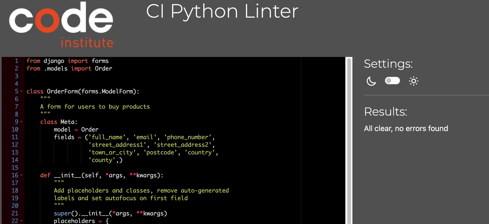
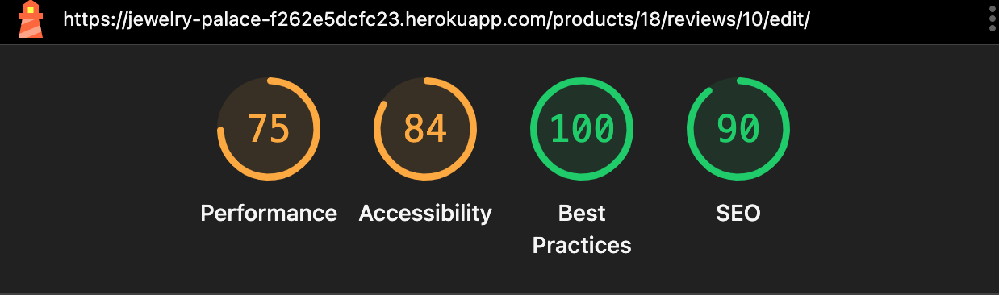
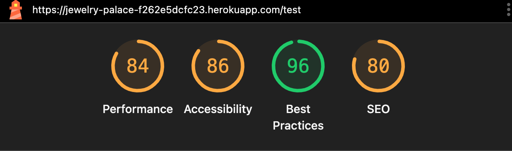
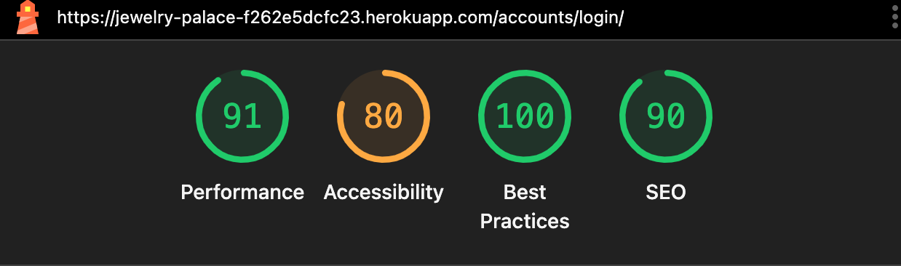

# Testing

## User Story Testing

* As a User, I can browse the product categories in order to find what I am looking for
    - Products can be sorted by category
    - Product counts shows that how many products are available in each category.

* As a user, I want to be able to search for a product by name in order to locate specific items with ease
    - The search bar is available in the product navigation bar
    - The search bar will return results for Product which matches the keyword in the title or description

* As a user, I can see a detailed breakdown of my order total, which information such as discounts cost, shipping costs in order to gain a full understanding of the full price I am paying.
    - Detail breakdown of the order are shown once the order has been successfully processed
    - Detail breakdown is also sent via email to the customer

* As a user, I want to be able to login and register in order to save my details and view my order history
    - Login and register links are working succesfully
    - Order history is shown on the my profile page - with order number
    - Chosen delivery address and other contact details saved under 'my profile"

* As a user, I want to be able to freely shop on the website, wishing for my data to be protected
    - Secure payment option using Stripe

* As a user, I want to a receive a confirmation message for when my order has been successful
    - Payment confirmation message appears on screen once stripe has accepted the payment
    
* As a user, I can sign up for a newsletter so I can receive regular updates and promotions
    - Newsletter Signup is located on the footer of the page
    - The user can suscribe to the newsletter by entering their email address on the newsletter form
    - The newsletter sign up form is available on all pages

* As a user, I can leave reviews for products so that I can share feedback with other customers
    - the user can submit a review by click on the leave a review button at the bottom of the product detail page
    - The leave a review is only available for logged in users
    - Existing reviews are also visible on the product detail page
    - Users cannot leave more than one review for a specific product
    - Users are able to udpdate and edit their reviews should they wish too
    - Under the My Review page, users can see the list of the reviews they have left(if they have left any)

* As an Admin, I can add new products to the collection so that users can see and purchase the latest item available on the site 
    - The admin user can add a product successfully from the product management page

* As an admin, I can edit existing product detail such as name, price, and description in order for the collection to be up to date as always
    - The admin user can edit an existing product from the product page. Only the admin user has the ability/authorisation to do so 
    - Toast message confirming products has been edited

* As admin, I have the functionality to delete products from the site if I wanted to discontinue a certain product or refresh the site.
    - The admin user can Delete product should they wish to do so via the product page
    - Toast message confirming that the products in question has been deleted.
    - Deleted product then dissapears from the product page

* As an admin, I am able to assign products to specific categories so that users can have an easier time finding their chosen item while browsing
    - Verify only admin have access to the product management page
    - Open product Add/Edit product page and assign one ore multiple categories
    - As a user, navigate to the product page and confirm only products that are assgined to that category is dsplayed

## Code Validation 

### HTML

[W3C Markup Validator](https://validator.w3.org/nu/) was used to Validate the HTML code for each html file. HTML was performed via source code text input

Page | Result | Screenshot | Pass/Fail
--- | --- | --- | ---
About | No errors or warnings to show | 

Validation Screenshot
 
 | Pass
Home | No errors or warnings to show | 

Validation Screenshot
 
 | Pass
Contact | No errors on warning to show | 

Validation Screenshot
 
 | Pass
Privary Policy | no errors or warnings to show | 

Validation Screenshot
 
 | Pass
Terms & conditons | no errors or warning to show | 

Validation Screenshot
 
 | Pass
Products | No errors or warnings to show | 

Validation Screenshot
 
 | Pass
Products detail | No errors or warning to show | 

Validation Screenshot
 
 | Pass
Sign Up | no errors or warning to show | 

Validation Screenshot
 
 | Pass
Sign In | No errors or warning to show | 

Validation Screenshot
 
 | Pass
Bag | No errors or warning to show | 

Validation Screenshot
 
 | Pass
Password Reset | No errors or warning to show | 

Validation Screenshot
 
 | Pass
Add a product | No errors or warning to show | 

Validation Screenshot
 
 | Pass
Edit a product | No errors or warning to show | 

Validation Screenshot
 
 | Pass
Add a Review | No errors or warning to show | 

Validation screenshot
 
 | Pass
Sign Out | No errors or warning to show | 

Validation Screenshot
 
 | Pass
My profile | No errors or warning to show | 

Validation Screenshot
 
 | Pass
Password Reset | No errors or warning to show | 

Validation Screenshot
 
 | Pass
Checkout | no errors or warning to show | 

Validation Screenshot
 
 | Pass
Checkout success | No errors or warning to show | 

Validation Screenshot
 
 | Pass

### CSS Validation

[W3C CSS Validator](https://jigsaw.w3.org/css-validator/) Was used to validate the CSS files.

Tested | Result | Screenshot | Pass
--- | --- | --- | ---
checkout.css | No errors or warnings to show | 

Validation Screenshot
 
 | Pass
profile.css | No errors or warnins to show | 

Validation Screenshot
 
 | Pass
base.css | No errors or warnings to show | 

Validation Screenshot
 
 | Pass

### Javascript Validation

[JSHint](https://jshint.com/) Was used to validate the custom Javascript code.

Tested | Result | Screenshot | Pass 
--- | --- | --- | ---
countryfield.js | No errors | 

Validation screenshot
 
 | Pass
stripe-elements.js | No erros | 

Validation Screenshot
 
 | Pass
JS code in bag.html | No errors | 

Validation Screenshot
 
 | Pass
JS code in quantity_input_script.html | No errors | 

Validation Screenshot
 
 | Pass
JS code in products.html | No errors | 

Validation Screenshot
 
 | Pass

### Python Validation 

[PEP8 Online Check ](https://pep8ci.herokuapp.com/) Was used to validate the python codes

#### Bag

Tested | Results | Screenshot | Pass/Fail
--- | --- | --- | ---
bag/apps.py | No errors | 

Validation Screenshot
 
 | Pass
context/apps.py | No errors | 

Validation Screenshot
 
 | Pass
bag/urls.py | No errors | 

Validation Screenshot
 
 | Pass
bag/views.py | No errors | 

Validation Screenshot
 <d/etails> | Pass
bags/bags_tools.py | No errors | 

Validation Screenshot
 
 | Pass

#### Checkout

Tested | Results | Screenshot | Pass/Fail
--- | --- | --- | ---
Checkout/admin.py | No errors | 

Validation Screenshot
 
 | Pass
Checkout/apps.py | No errors | 

Validation Screenshot
 
 | Pass
Checkout/form.py | No errors | 

Validation Screenshot
 
 | Pass
Checkout/models.py | No errors | 

Validation Screenshot
 
 | Pass
Checkout/signals.py | No errors | 

Validation Screenshot
 
 | Pass
Checkout/urls.py | No errors | 

Validation Screenshot
 
 | Pass
Checkout/views.py | No errors | 

Validation Screenshot
 
 | Pass
Checkout/webhook_handler.py | No errors | 

Validation Screenshot
 
 | Pass
Checkout/webhooks.py | No errors | 

Validation Screenshot
 
 | Pass

#### Contact 

Tested | Results | Screenshot | Pass/Fail
--- | --- | --- | ---
Contact/admin.py | No errors | 

Validaton Screenshot
 
 | Pass
Contact/apps.py | No errors | 

Validation Screenshot
 
 | Pass
Contact/forms.py | No errors | 

Validation Screenshot
 
 | Pass
Contact/models.py | No errors | 

Validation Screenshot
 
 | Pass
Contact/urls.py | No errors | 

Validation Screenshot
 
 | Pass
Contact/views.py | No errors | 

Validation Screenshot
 
 | Pass

#### Home

Tested | Results | Screenshot | Pass/Fail
--- | --- | --- | ---
Home/apps.py | No errors | 

Validation Screenshot
 
 | Pass
Home/urls.py| No errors | 

Validation Screenshot
 
 | Pass
Home/views.py | No errors | 

Validation Screenshot
 
 | Pass

#### Jewelry_palace

Tested | Results | Screenshot | Pass/Fail
--- | --- | --- | ---
Jewelry_palace/settings.py | No errors | 

Validation Screenshot
 
 | Pass
Jewelry_palace/urls.py | No errors | 

Valiation Screenshot
 
 | Pass
Jewelry_palace/views.py | No errors | 

Validation Screenshot
 
 | Pass
Jewelry_palace/wsgi.py | No errors | 

Validation Screenshot
 
 | Pass

#### Product 

Tested | Results | Screenshot | Pass/Fail
--- | --- | --- | ---
products/admin.py | No errors | 

Validation Screenshot
 
 | Pass
Products/apps.py | No errors | 

Validation Screenshot
 
 | Pass
Products/forms.py | No errors | 

Validation Screenshot
 
 | Pass
Products/models.py | No errors | 

Validation Screenshot
 
 | Pass
Products/urls.py | No errors | 

Validation Screenshot
 
 | Pass
Products/views.py | No errors | 

Validation Screenshot
 
 | Pass
Products/widgets.py | No errors | 

Validation Screenshot
 
 | Pass

#### Profiles 

Tested | Results | Screenshot | Pass/Fail
--- | --- | --- | ---
Profiles/apps.py | No errors | 

Validation Screenshot
 
 | Pass
Profiles/forms.py | No erros | 

Validation Screenshot
 
 | Pass
Profiles/models.py | No errors | 

Validation Screenshot
 
 | Pass
profiles/urls.py | No errors | 

Validation Screenshot
 
 | Pass
Profiles/views.py | No errors | 

Validation Screenshot
 
 | Pass

# Manual Testing

| Feature | Test  | Expected Results  | Actual Result |
|---------|------|------------------| :----:|
| Jewelry Palace logo | Selecting Jewelery Palace on homepage | direct user to homepage | Pass  |
| Navigation Links | Selecting navigation links  | directs users to relevant categories | Pass  |
| All categories  | Selecting all for each category  | directs users to show all relevant categories on the same page |  Pass  |
| Sort by  | Selecting the filter sort by for each category | Successfully alters by price, rating, category and name | Pass |
| About us | Selecting About us | directs users to the about us Page | Pass  |
| Privacy Policy  | Selecting Privacy Policy | directs users to the about page | Pass |
| Terms % conditions | Selecting Terms and condition | directs users to the terms and condition page | pass  |
| Register  | Register for an account  | selecting Register in my account directs users to accounts/login/ signup page  | Pass |
| Login  | Login to account | Selecting login in my account directs user to accounts/login page | Pass
| Back to top  | Back to top box  | Selecting the back to top on the products pages brings the user back to the top of the page | Pass
| New User  |  Registering as a new user | Registering as a new user via form validation | Pass
| Admin  | Loggin in as admin/superuser  | Logging in as superuser/ admin directs the the user to the admin page, where the admin has access to product management page  | Pass
| login successfull message | login success | successfully signed in as {user.name} | Pass  |
| Add product  | adding a new product  |  Adding a new product on the product managemment page successfully  |  Pass  |
| Edit product | Editing a product | Editing a product on the product management page sucessfully |Pass |
| Delete Product| Deleting a product|Deleting a product on the product management page sucessfully| Pass |
|Logout | logging out and redirect  | logging out as a user / admin directs user to homepage | Pass |
|Logout message | logout message shown | You have succesfully signed out message shown to the user once successfully signed out | Pass  |
Footer | Social media links | clicking on social media icons in the footer open the link in a new tab | Pass |
Footer | Contact info | footer display clear contact info as to how to get in touch | Pass |

## Search & sort functionality

Element | Expected | Pass/Fail 
--- | --- | ---
Search Bar | Users can search for products using keywords | ✅Pass 
Search Bar | Search results are displayed correctly | ✅Pass
Search Bar | Message saying *0 Products* is displayed if no results are found | ✅Pass
Sort Options | allows sorting products by categories, price, rating and name | ✅Pass

## Product Listing

Element | Expected | Pass/Fail
--- | --- | ---
Product List | Products are diplayed in a grid format | ✅Pass
Product List | Products are listed in card format with name, price & rating | ✅Pass
Product Card | Clicking on a product card redirects the user to the product detail page | ✅Pass
Product Details | Product details (Name, Price, rating and description) | ✅Pass
Add to basket | Adds the product selected to the basket | ✅Pass
Quantity select | Allows the users to select the quantiy of product | ✅Pass
Reviews Section | Displays all reviews for a product | ✅Pass

# Form Testing

## Contact form Validation

Field | Test input | Expected Result | Result | Pass
--- | --- | --- | --- | --- 
Name | Empty field | "Please fill empty fields" | Error shown | Pass
Name | "Dave Best" | Valid name | No errors | Pass
Email | 'invalid email' | invalid format | error shown | Pass
Email | test1@hotmail.com | valid email | No errors | Pass
Body | Empty Field | "Please fill empty fiels" | Error shown | Pass
Body | Valid Message | Message accepted| No errors | Pass

## Checkout Form Validation 

Field | Test Input | Expected Results | Actual Result | Pass/Fail
--- | --- | --- | --- | --- |
Full Name | Empty Field | Error | Error Shown | Pass
Phone | Invalid format | Error | Error shown | Pass
Email | Invalid Format | Error | Error shown | Pass
Address | Empty Field | Error | Error shown | Pass
Country | Empty Field | Error | Error shown | Pass

## Payment Process Testing

Stage | Action | Expectation | Result | Pass
--- | --- | --- | --- | --- |
1 | Add items to basket | Basket total calculated | Correct total | Pass
2 | Proceed to checkout | Checkout form displayed, to be filled | Form loads successfully | Pass
3 | Enter shipping details | Form validation functions | Form validation | Pass
4 | Enter paying details | stripe elements loads with no issue | stripe loads | Pass
5 | Payment submittion | payment processed | Payment processing works | Pass
6 | Order confirmation | Order confirmation page shown | Confirmation page displayed | Pass
7 | Email confirmation | Confirmation email sent | Confirmation email received | Pass 

## Stripe Payment Test

Test | Card number | CVV | Expiry Date | Expected Results | Actual Results | Pass
--- | --- | --- | --- | --- | --- | ---  
Payment successfull | 4242 4242 4242 4242 | 424 | 12/25 | Payment success | Payment processed | Pass
Payment card declined | 4000 0000 0000 0002 | 424 | 12/25 | Payment fails | Error | Pass
Payment card expired | 4242 4242 4242 4242 | 424 | 12/24 | Card expired | Error | Pass

# Device and Browser Testing

Browser | Outcome | Pass/Fail
--- | --- | --- 
Safari | No appearance or responsiveness issues | ✅ Pass
Firefox | No appearance or responsiveness issues | ✅Pass
Google Chrome | No appearance or responsiveness issues | ✅Pass
Microsoft Edge | No appearance or responsiveness issues | ✅Pass

# Accessibility

Tested | Results 
--- | ---
Home | 

Lighthouse Image

About Us | 

Lighthouse Image

Contact | 

Lighthouse Image

Privacy Policy | 

Lighthouse Image

Terms & Conditions | 

Lighthouse Image

Shopping Bag | 

Lighthouse Image

Product | 

Lighthouse Image

Product Detail | 

Lighthouse Image

Checkout | 

Lighthouse Image

Checkout Success | 

Lighthouse Image

Profile | 

Lighthouse Image

Product Management | 

Lighthouse Image

My Reviews | 

Lighthouse Image

Edit Review | 

Lighthouse Image

Delete Review | 

Lighthouse Image

Add Review | 

Lighthouse Image

404 | 

Lighthouse Image

Sign In | 

Lighthouse Image

Sign Out | 

Lighthouse Image

Sign Up | 

Lighthouse Image

