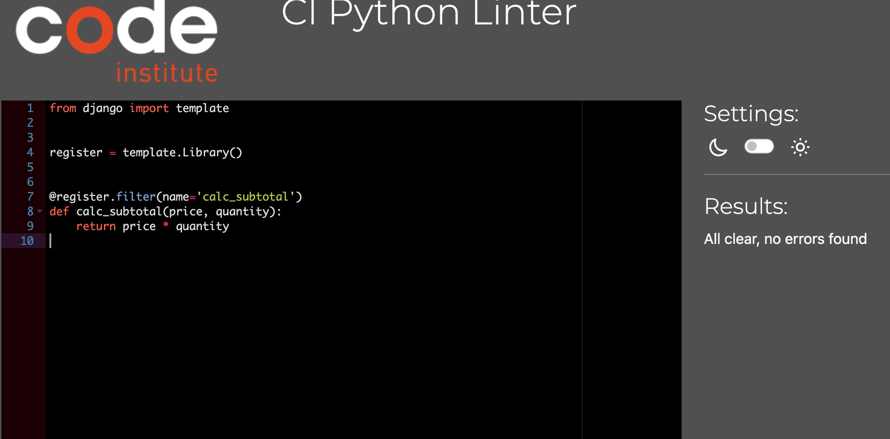
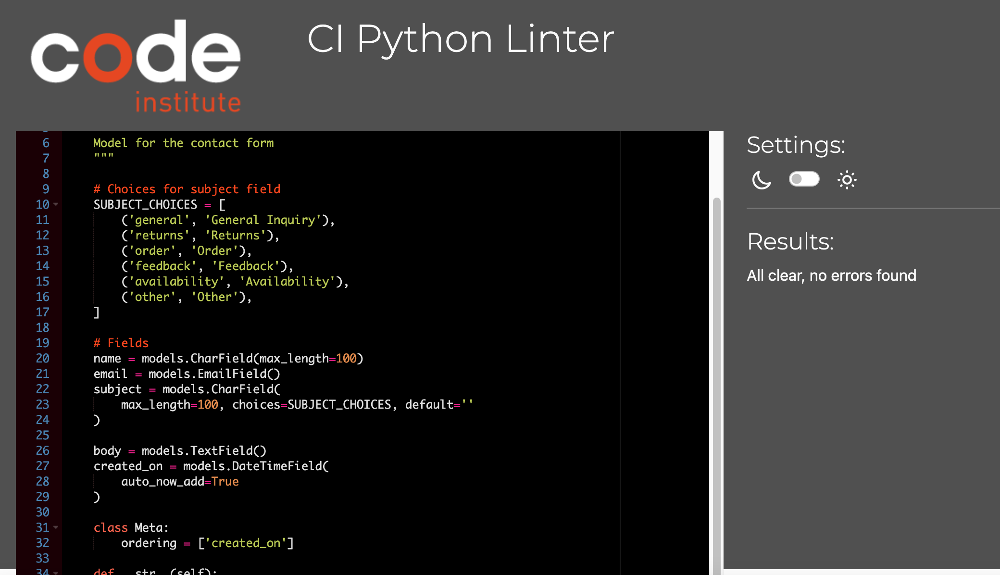

# Testing

## Code Validation 

### HTML

Page | Result | Screenshot | Pass/Fail
--- | --- | --- | ---
About | No errors or warnings to show | 

Validation Screenshot
 
 | Pass
Home | No errors or warnings to show | 

Validation Screenshot
 
 | Pass
Contact | No errors on warning to show | 

Validation Screenshot
 
 | Pass
Privary Policy | no errors or warnings to show | 

Validation Screenshot
 
 | Pass
Terms & conditons | no errors or warning to show | 

Validation Screenshot
 
 | Pass
Products | No errors or warnings to show | 

Validation Screenshot
 
 | Pass
Products detail | No errors or warning to show | 

Validation Screenshot
 
 | Pass
Sign Up | no errors or warning to show | 

Validation Screenshot
 
 | Pass
Sign In | No errors or warning to show | 

Validation Screenshot
 
 | Pass
Bag | No errors or warning to show | 

Validation Screenshot
 
 | Pass
Password Reset | No errors or warning to show | 

Validation Screenshot
 
 | Pass
Add a product | No errors or warning to show | 

Validation Screenshot
 
 | Pass
Edit a product | No errors or warning to show | 

Validation Screenshot
 
 | Pass
Add a Review | No errors or warning to show | 

Validation screenshot
 
 | Pass
Sign Out | No errors or warning to show | 

Validation Screenshot
 
 | Pass
My profile | No errors or warning to show | 

Validation Screenshot
 
 | Pass
Password Reset | No errors or warning to show | 

Validation Screenshot
 
 | Pass
Checkout | no errors or warning to show | 

Validation Screenshot
 
 | Pass
Checkout success | No errors or warning to show | 

Validation Screenshot
 
 | Pass

### CSS Validation

Tested | Result | Screenshot | Pass
--- | --- | --- | ---
checkout.css | No errors or warnings to show | 

Validation Screenshot
 
 | Pass
profile.css | No errors or warnins to show | 

Validation Screenshot
 
 | Pass
base.css | No errors or warnings to show | 

Validation Screenshot
 
 | Pass

### Javascript Validation 

Tested | Result | Screenshot | Pass 
--- | --- | --- | ---
countryfield.js | No errors | 

Validation screenshot
 
 | Pass
stripe-elements.js | No erros | 

Validation Screenshot
 
 | Pass
JS code in bag.html | No errors | 

Validation Screenshot
 
 | Pass
JS code in quantity_input_script.html | No errors | 

Validation Screenshot
 
 | Pass
JS code in products.html | No errors | 

Validation Screenshot
 
 | Pass

### Python Validation 

[PEP8 Online Check ](https://pep8ci.herokuapp.com/) Was used to validate the python codes

#### Bag

Tested | Results | Screenshot | Pass/Fail
--- | --- | --- | ---
bag/apps.py | No errors | 

Validation Screenshot
 
 | Pass
context/apps.py | No errors | 

Validation Screenshot
 
 | Pass
bag/urls.py | No errors | 

Validation Screenshot
 
 | Pass
bag/views.py | No errors | 

Validation Screenshot
 <d/etails> | Pass
bags/bags_tools.py | No errors | 

Validation Screenshot
 
 | Pass

#### Checkout

Tested | Results | Screenshot | Pass/Fail
--- | --- | --- | ---
Checkout/admin.py | No errors | 

Validation Screenshot
 
 | Pass
Checkout/apps.py | No errors | 

Validation Screenshot
 
 | Pass
Checkout/form.py | No errors | 

Validation Screenshot
 
 | Pass
Checkout/models.py | No errors | 

Validation Screenshot
 
 | Pass
Checkout/signals.py | No errors | 

Validation Screenshot
 
 | Pass
Checkout/urls.py | No errors | 

Validation Screenshot
 
 | Pass
Checkout/views.py | No errors | 

Validation Screenshot
 
 | Pass
Checkout/webhook_handler.py | No errors | 

Validation Screenshot
 
 | Pass
Checkout/webhooks.py | No errors | 

Validation Screenshot
 
 | Pass

#### Contact 

Tested | Results | Screenshot | Pass/Fail
--- | --- | --- | ---
Contact/admin.py | No errors | 

Validaton Screenshot
 
 | Pass
Contact/apps.py | No errors | 

Validation Screenshot
 
 | Pass
Contact/forms.py | No errors | 

Validation Screenshot
 
 | Pass
Contact/models.py | No errors | 

Validation Screenshot
 
 | Pass
Contact/urls.py | No errors | 

Validation Screenshot
 
 | Pass
Contact/views.py | No errors | 

Validation Screenshot
 
 | Pass

#### Home

Tested | Results | Screenshot | Pass/Fail
--- | --- | --- | ---
Home/apps.py | No errors | 

Validation Screenshot
 
 | Pass
Home/urls.py| No errors | 

Validation Screenshot
 
 | Pass
Home/views.py | No errors | 

Validation Screenshot
 
 | Pass

#### Jewelry_palace

Tested | Results | Screenshot | Pass/Fail
--- | --- | --- | ---
Jewelry_palace/settings.py | No errors | 

Validation Screenshot
 
 | Pass
Jewelry_palace/urls.py | No errors | 

Valiation Screenshot
 
 | Pass
Jewelry_palace/views.py | No errors | 

Validation Screenshot
 
 | Pass
Jewelry_palace/wsgi.py | No errors | 

Validation Screenshot
 
 | Pass

#### Product 

Tested | Results | Screenshot | Pass/Fail
--- | --- | --- | ---
products/admin.py | No errors | 

Validation Screenshot
 
 | Pass
Products/apps.py | No errors | 

Validation Screenshot
 
 | Pass
Products/forms.py | No errors | 

Validation Screenshot
 
 | Pass
Products/models.py | No errors | 

Validation Screenshot
 
 | Pass
Products/urls.py | No errors | 

Validation Screenshot
 
 | Pass
Products/views.py | No errors | 

Validation Screenshot
 
 | Pass
Products/widgets.py | No errors | 

Validation Screenshot
 
 | Pass

#### Profiles 

Tested | Results | Screenshot | Pass/Fail
--- | --- | --- | ---
Profiles/apps.py | No errors | 

Validation Screenshot
 
 | Pass
Profiles/forms.py | No erros | 

Validation Screenshot
 
 | Pass
Profiles/models.py | No errors | 

Validation Screenshot
 
 | Pass
profiles/urls.py | No errors | 

Validation Screenshot
 
 | Pass
Profiles/views.py | No errors | 

Validation Screenshot
 
 | Pass